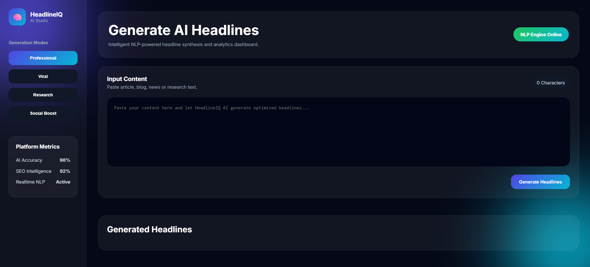
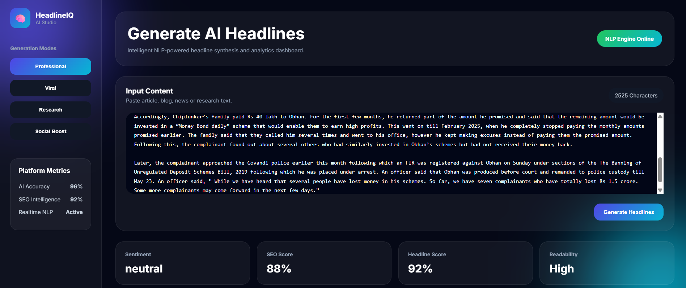
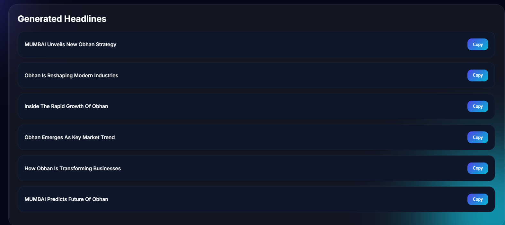

# 🧠 HeadlineIQ AI

An AI-powered NLP-based headline generation platform that analyzes textual content and generates optimized, engaging, and SEO-friendly headlines using Natural Language Processing techniques.

---

## 🚀 Features

- ✨ AI-powered headline generation
- 📰 Multiple headline generation styles
- 😊 Sentiment analysis
- 🔑 TF-IDF keyword extraction
- 🏷️ Named Entity Recognition (NER)
- 📈 SEO-oriented analytics
- ⚡ Real-time text processing
- 🎨 Modern responsive UI

---

## 🛠️ Tech Stack

### Backend
- Python
- Flask
- NLTK
- spaCy
- TextBlob
- Scikit-learn

### Frontend
- HTML5
- CSS3
- JavaScript

### NLP Techniques
- TF-IDF Vectorization
- Sentiment Analysis
- Text Normalization
- Named Entity Recognition
- Dynamic Headline Synthesis

---

## 📂 Project Structure

```bash
headlineiq-ai/
│
├── app.py
├── requirements.txt
│
├── core/
│   ├── headline_generator.py
│   ├── sentiment.py
│   ├── keyword_extractor.py
│   └── ner.py
│
├── static/
│   ├── css/
│   ├── js/
│   └── images/
│
├── templates/
│   ├── index.html
│   └── result.html
│
├── screenshots/
│
└── README.md
```

---

## 🧠 NLP Pipeline

1. Text preprocessing
2. Tokenization
3. Stopword removal
4. Keyword extraction using TF-IDF
5. Sentiment analysis
6. Named entity recognition
7. Headline generation
8. SEO optimization

---

## ⚙️ Installation

### 1️⃣ Clone Repository

```bash
git clone https://github.com/KaranBisht111/headlineiq-ai.git
```

---

### 2️⃣ Navigate to Project

```bash
cd headlineiq-ai
```

---

### 3️⃣ Install Dependencies

```bash
pip install -r requirements.txt
```

---

### 4️⃣ Install spaCy Model

```bash
python -m spacy download en_core_web_sm
```

---

### 5️⃣ Run Flask Application

```bash
python app.py
```

---

## 🌐 Access Application

Open browser:

```bash
http://127.0.0.1:5000
```

---

## 📸 Screenshots

### 🖥️ Dashboard

<p align="center">
  
</p>

---

### 📊 NLP Analytics

<p align="center">
  
</p>

---

### 📰 Generated Headlines

<p align="center">
  
</p>

---


## 📈 Future Improvements

- Transformer-based NLP models
- GPT-powered headline generation
- Multi-language support
- AI headline scoring engine
- User authentication
- Database integration
- Export functionality
- API deployment

---

## 📚 Learning Outcomes

This project demonstrates:

- Natural Language Processing
- Sentiment Analysis
- TF-IDF Vectorization
- Named Entity Recognition
- Flask web development
- Text analytics
- AI-based content generation

---

## 🔒 Security Considerations

- Input sanitization
- Rate limiting
- API protection
- Model optimization
- Secure deployment configuration

---

## 📦 Requirements

Main dependencies:

- Flask
- NLTK
- spaCy
- TextBlob
- Scikit-learn
- NumPy
- Pandas
---

## 📜 License

This project is licensed under the MIT License.
---

## 👨‍💻 Author

Karan Bisht

---

## ⭐ Support

If you found this project useful, consider giving it a star ⭐ on GitHub.

